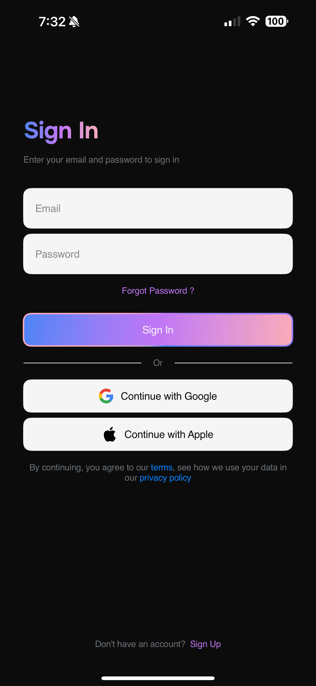
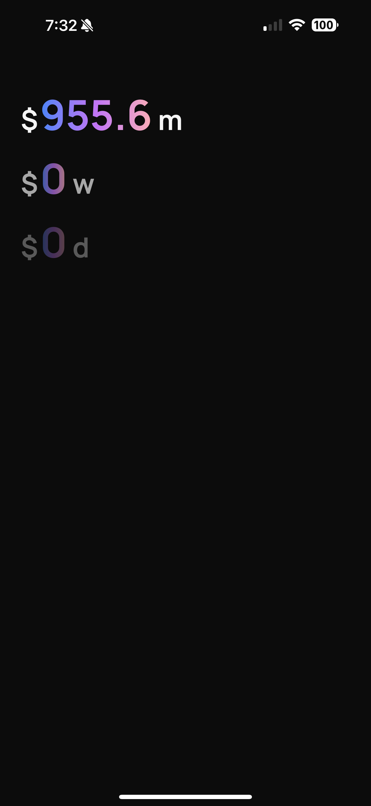
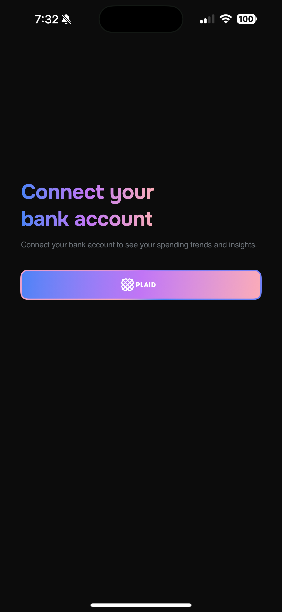

# Glance: Personal Finance, Simplified

[](https://developer.apple.com/xcode/swiftui/)
[](https://go.dev/)
[](https://firebase.google.com/)
[](https://plaid.com/)

Glance is a beautifully simple iOS application designed to give you an at-a-glance overview of your daily, weekly, and monthly spending. By securely connecting to your bank accounts, it provides a clean, minimalist interface focused on one thing: clarity in your personal finances. This project spans the full stack, from a native SwiftUI front end to a powerful Go backend, all tied together with modern cloud services.

## Demo

Here is a glimpse of the user experience, from authentication to viewing your spending data.

| Login Screen | Spending Dashboard |
| :---: | :---: |
|  |  |

| Account Linking |
| :---: |
|  |

## 🚀 Project Purpose & Motivation

Glance started as a hackathon project (the original T3 stack version can be viewed [here](https://github.com/ukhan1219/glance)) and has since been completely rewritten and evolved into a passion project and a powerful portfolio piece. The primary motivation was twofold:

1.  **To Build a Real-World Application:** I wanted to take an idea from concept to a fully deployed iOS app that my friends and I could use. Today, Glance serves over 100 concurrent users, providing real value and a testbed for continuous improvement.
2.  **To Master New Technologies:** This project was a deliberate learning exercise to dive deep into unfamiliar technologies. It was an opportunity to challenge my skills in **SwiftUI** by creating a beautiful, simple, and intuitive user interface, and to build a robust, secure, and scalable backend using **Go**.

Glance showcases a full-stack skill set, from thoughtful UI/UX design on the frontend to secure, performant API development on the backend. It's a testament to the process of building, learning, and iterating.

## ✨ How It Works: The Full-Stack Architecture

Glance is built on a modern, decoupled architecture, ensuring security, scalability, and maintainability. Each component has a distinct responsibility.

```
+-------------------+      +----------------------+      +---------------------+
|    iOS App        |----->|   Backend Server     |----->|     Plaid API       |
| (SwiftUI)         |      | (Go / Gin)           |      | (Connects to Banks) |
| - UI Views        |<-----| - API Endpoints      |<-----|                     |
| - Plaid Link SDK  |      | - Plaid Client       |      +---------------------+
| - Firebase Auth   |      | - Secure Data Logic  |
+--------|----------+      +--------|-------------+      +---------------------+
         |                           |                   |   Firebase Services |
         |                           +------------------>| - Authentication    |
         | (Auth Tokens)             |                   | - Firestore DB      |
         |                           +------------------>| - Cloud Functions   |
         v                                               +---------------------+
+--------|----------+
| iOS Keychain      |
| (for session)     |
+-------------------+
```

### 1. iOS Application (Frontend)

The user-facing component is a native iOS app built entirely with **SwiftUI**.
-   **Authentication:** The app uses the **Firebase Authentication** SDK for secure sign-up and sign-in (Email/Password and Sign in with Apple). It leverages iOS's **Keychain** and **Biometrics (Face ID/Touch ID)** for persistent, secure sessions.
-   **Plaid Integration:** It integrates the **Plaid Link iOS SDK**, which provides a secure, sandboxed webview for users to connect their financial institutions.
-   **API Communication:** All communication with the backend is done over a secure REST API. The app sends a Firebase ID token with each request, which the backend verifies to authenticate the user.

### 2. Go Backend (API)

The backend is a high-performance server written in **Go**, using the **Gin** web framework.
-   **Secure Endpoints:** It exposes a set of REST API endpoints for handling core logic, such as creating Plaid Link tokens, exchanging public tokens for permanent access tokens, and calculating spending summaries.
-   **Authentication Middleware:** Every protected endpoint uses middleware to intercept and verify the Firebase ID token from the `Authorization` header, ensuring only authenticated users can access their data.
-   **Data Processing:** The backend is responsible for all sensitive operations. It securely communicates with the Plaid API, fetches raw transaction data, and performs the necessary calculations to determine daily, weekly, and monthly spending totals before sending the aggregated, non-sensitive data to the iOS app.

### 3. Firebase & Plaid (Backend Services)

-   **Firebase Authentication:** Acts as the identity provider, managing user accounts and credentials securely.
-   **Firestore Database:** A NoSQL database used to store relationships between users and their linked Plaid items. Crucially, sensitive Plaid `access_token` values are stored here, encrypted at rest. Firestore security rules are configured to ensure a user can only ever access data linked to their own user ID.
-   **Firebase Cloud Functions:** The `functions/` directory contains TypeScript code for serverless functions, used for specific backend triggers or automated tasks.
-   **Plaid API:** The core of the financial data. Plaid acts as a secure bridge to thousands of financial institutions, allowing Glance to retrieve transaction data without ever handling or storing bank credentials.

## 🛠️ Technology Stack

*   **iOS Application:**
    *   **SwiftUI** & **Swift 5**
    *   **Plaid Link iOS SDK** for bank connection.
    *   **Firebase SDK** (Auth, Firestore) for user management.
    *   **LocalAuthentication** for Face ID / Touch ID.
*   **Backend Server:**
    *   **Go (Golang)**
    *   **Gin** Web Framework
    *   **Plaid Go Client** library
    *   **Firebase Admin Go SDK**
*   **Cloud & Database:**
    *   **Firebase Authentication**
    *   **Firestore** (NoSQL Database)
    *   **Firebase Cloud Functions** (TypeScript)
*   **Tooling:**
    *   Xcode
    *   Git & GitHub

## 📦 Project Components

*   **`backend/`**: The Go server application.
    *   `cmd/server/main.go`: The main entry point for the server.
    *   `internal/`: Contains all the core business logic, including API handlers, middleware, and Plaid/Firebase service integrations.
    *   `go.mod`, `go.sum`: Go module dependencies.
*   **`ios/`**: The Xcode project for the SwiftUI application.
    *   `Glance/`: Source code for the app.
    *   `Core/`: Contains shared logic like API services, auth view models, and Plaid integration.
    *   `Features/`: Contains the UI views for different parts of the app (Authentication, Dashboard, etc.).
    *   `Glance.xcodeproj`: The Xcode project file.
*   **`functions/`**: The Firebase Cloud Functions project written in TypeScript.
*   **`firebase.json`**: Configuration for Firebase services.

## 🔧 How to Replicate

### Prerequisites
*   macOS with Xcode 15 or newer.
*   Go 1.21 or newer.
*   Node.js and the Firebase CLI (`npm install -g firebase-tools`).
*   A **Firebase Project** with Authentication (Email/Password, Apple) and Firestore enabled.
*   A **Plaid Account** with API keys for the Sandbox environment.

### Backend Setup
1.  **Configure Firebase:**
    *   In your Firebase project settings, go to Service Accounts and generate a new private key. Save this file as `serviceAccountKey.json` inside the `backend/` directory.
2.  **Environment Variables:**
    *   Create a `.env` file in the `backend/` directory and populate it with your credentials:
        ```env
        PLAID_CLIENT_ID=your_plaid_client_id
        PLAID_SECRET=your_plaid_secret
        PLAID_ENV=sandbox
        PORT=8080
        FIREBASE_CREDENTIALS=./serviceAccountKey.json
        ```
3.  **Install Dependencies:**
    ```bash
    cd backend
    go mod tidy
    ```
4.  **Run the Server:**
    ```bash
    go run cmd/server/main.go
    ```
    The server will start on `http://localhost:8080`.

### iOS Setup
1.  **Configure Firebase:**
    *   In your Firebase project, add an iOS app. Follow the setup instructions to download the `GoogleService-Info.plist` file.
    *   Open `ios/Glance.xcodeproj` in Xcode.
    *   Drag the downloaded `GoogleService-Info.plist` file into the `Glance/` group in the Xcode project navigator.
2.  **Update API Endpoint:**
    *   In `ios/Glance/Core/API/APIService.swift`, ensure the `baseURL` points to your local backend server (`http://localhost:8080`).
3.  **Build and Run:**
    *   Select an iOS Simulator or a physical device.
    *   Build and run the application from Xcode (▶).

## 🏆 Accomplishments & Learnings

*   **Accomplished:**
    *   Successfully built and deployed a full-stack application from scratch using a new tech stack (Go and SwiftUI).
    *   Architected a secure and robust authentication and data flow between a mobile client and a backend server, following GCP and Firebase best practices.
    *   Designed and implemented a clean, simple, and intuitive UI that successfully serves over 100 users.
*   **Learned:**
    *   The intricacies of the Plaid API and the complexities of managing the data flow required for financial integrations. I'm particularly proud that the authentication and database systems worked correctly and securely on the first implementation attempt.
    *   How to structure a scalable Go backend with Gin, including middleware for authentication.
    *   The power and flexibility of SwiftUI for rapidly building beautiful user interfaces.

## 🔮 Future Work

Glance is actively being developed and improved. Key areas of focus include:
*   **Performance:** Optimizing backend calculations and database queries to ensure the app remains fast as user numbers grow.
*   **UI/UX Enhancements:** Adding more detailed transaction views, spending categorization, and custom date range filtering.
*   **Expanded Features:** Exploring features like budget setting, subscription tracking, and personalized financial insights.

---
This project was a fantastic journey into full-stack development. I hope it serves as a strong example of my ability to learn new technologies and build functional, user-centric products. 